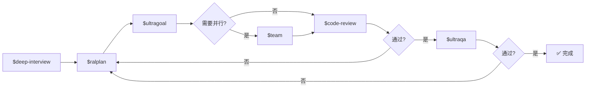

# OMX (oh-my-codex) 使用示例大全

> **OMX** = OpenAI Codex CLI 的多 Agent 编排层。它不替代 Codex，而是增加：**更好的任务路由 + 更好的工作流 + 更好的运行时**。

## 1. 🚀 安装与启动

```bash
# 安装（需要 Node.js 20+ 和 Codex CLI）
npm install -g oh-my-codex

# 验证安装
omx doctor

# 检查认证
codex login status

# 执行烟雾测试
omx exec --skip-git-repo-check -C . "Reply with exactly OMX-EXEC-OK"

# 启动一个强会话（推荐从 git 项目内启动）
omx --worktree=feat/task --madmax --xhigh
```
> `--madmax` = 跳过沙箱审批（`--dangerously-bypass-approvals-and-sandbox`）  
> `--xhigh` = 最高推理强度（`-c model_reasoning_effort="xhigh"`）  
> `--worktree=<name>` = 在独立 git worktree 中启动，安全隔离

### 并发多个任务会话
```bash
omx --worktree=feature/auth --madmax --xhigh
omx --worktree=fix/flaky-tests --madmax --xhigh  # 第二个并发会话
```

---

## 2. 🎯 核心工作流（Canonical Workflow）

### 2.1 完整交付流水线（Autopilot）

最完整的端到端自主交付循环：

```
$autopilot "为一个博客系统添加 Markdown 编辑器支持"
```

Autopilot 内部自动执行这个管道：



### 2.2 最简实用流程

```text
# 步骤1：明确需求
$deep-interview "我想加一个用户登录功能"

# 步骤2：制定并审批计划
$ralplan "登录功能：邮箱+密码+JWT"

# 步骤3：执行
$ultragoal "按照审批的计划实现登录功能"
```

### 2.3 快速修复模式

```text
# 单个修复任务（跳过规划）
$ralph "修复登录按钮样式不居中的问题"
```

### 2.4 并行协作模式

```bash
# 启动 3 个 worker 并行执行
omx team 3:executor "修复所有失败的测试，并输出验证结果"
omx team status <team-name>
omx team resume <team-name>
omx team shutdown <team-name>
```

---

## 3. 💡 各个 Skill 详解

### `$deep-interview` — 苏格拉底式需求澄清

当需求模糊时，OMX 会通过结构化提问链澄清意图、范围、约束和验收标准。

```text
$deep-interview "我想做个看板应用"
# OMX 会依次提问：
#   Round 1 | 目标: 意图澄清 | 模糊度: 80%
#   → "用户是谁？个人使用还是团队协作？"
#   Round 2 | 目标: 范围澄清 | 模糊度: 60%
#   → "需要拖拽排序、多用户、还是简单列管理？"
#   ...直到模糊度 < 20%
```

### `$ralplan` — 多角色共识规划

Planner → Architect → Critic 三个 Agent 反复迭代直到达成共识。

```text
$ralplan "实现一个 Redis 缓存层"
# 输出物：
# - 计划文档 (.omx/plans/...)
# - 架构评审结论
# - 验证矩阵

$ralplan --interactive "用户权限系统重构"    # 交互模式，可中途确认
$ralplan --deliberate "数据库迁移方案"        # 深度模式（高风险任务）
```

### `$ultragoal` — 持久化多目标执行

将任务转为 repo 本地持久化产物，有检查点和验证。

```text
$ultragoal "分三个阶段实现搜索功能：Elasticsearch 集成 → API 封装 → 前端搜索框"

# 产物：
# .omx/ultragoal/brief.md       → 任务概要
# .omx/ultragoal/goals.json     → 目标定义
# .omx/ultragoal/ledger.jsonl   → 检查点日志
# .omx/ultragoal/checkpoints/   → 各阶段检查点
```

### `$ultrawork` — 并行执行引擎

并行执行独立子任务。

```text
$ultrawork "重构三个模块：用户服务、订单服务、支付服务"

# 输出格式：
# - 并行运行独立任务
# - 每个任务有明确的验收标准
# - 完成时附带验证证据
```

### `$team` — tmux 多 Agent 协作

启动真正的 worker Codex/Claude CLI 会话在分屏中并行工作。

```text
$team "为项目添加 CI/CD 流水线和单元测试"
# Leader 状态: 
#   Worker 1: Codex | Dockerfile + GitHub Actions
#   Worker 2: Claude | Jest 测试配置
#   Worker 3: Codex | 集成测试
```

### `$ralph` — 自我迭代直到完成

自动重试循环 + Architect 验证。

```text
$ralph "实现完整错误处理中间件"
# 循环直到：
#   1. 所有需求满足
#   2. 零待办项
#   3. 测试全部通过
#   4. Architect 验证签名
```

### `$code-review` — 代码审查

```text
$code-review "审查本次实现的代码变更"
# 输出：APPROVE / REQUEST CHANGES / COMMENT
# 附带逐行评审意见
```

### `$ultraqa` — 对抗性 QA

```text
$ultraqa "对搜索功能进行 QA"
# 测试边界条件、异常场景、性能退化
```

---

## 4. 🛠️ 辅助命令

```bash
# 设置 OMX
omx setup --scope project --merge-agents   # 项目级设置
omx setup --scope user                       # 用户级设置

# 诊断
omx doctor                                   # 检查安装

# 更新
omx update                                   # 检查并安装最新版

# 直接启动（无 tmux 管理）
omx --direct --yolo

# HUD 监控
omx hud --watch

# 执行一次性命令
omx exec --skip-git-repo-check -C /tmp "echo hello"

# 探索代码库
omx explore "..."
```

---

## 5. 🧠 OMX 的简单心智模型

```
Codex  → 实际的 AI Agent 工作引擎
OMX    → 任务路由 + 工作流编排 + 运行时增强
.omx/  → 计划、日志、记忆、运行时状态目录
Skills → 可复用的工作流模板 ($deep-interview, $ralplan, ...)
```

---

## 6. 📦 可用 Skills 一览

| 类别 | Skills |
|------|--------|
| **核心流程** | `$autopilot`, `$ultragoal`, `$ultrawork`, `$ralph`, `$team` |
| **规划与澄清** | `$deep-interview`, `$ralplan`, `$plan`, `$prometheus-strict` |
| **审查与质量** | `$code-review`, `$ultraqa`, `$security-review`, `$visual-verdict` |
| **搜索与分析** | `$analyze`, `$explore`, `$deepsearch` (已弃用) |
| **Git 相关** | `$git-master`, `$build-fix` |
| **团队协作** | `$swarm`, `$worker` |
| **AI 辅助** | `$ask-claude`, `$ask-gemini` |
| **文档与笔记** | `$note`, `$help`, `$wiki` |
| **效率** | `$ecomode`, `$trace`, `$tdd`, `$web-clone` |

---

以上所有内容均来自 OMX 源码（v0.18.15）、README、以及 50+ 个 Skill SKILL.md 文件。完整的技能库可以在 `memory/OMX/` 中找到。


---

## 附录：文献系统应用案例（合并自 OMX 学习笔记）

※ 技能速查部分见上文各章节。

## 二、文献系统在OMX框架中的映射

### 2.1 OMX Skill → 系统能力映射

| OMX能力 | 系统中使用场景 |
|---------|--------------|
| `$team` | 并行抓取多数据源、并行分析多篇论文 |
| `$ultragoal` | 管理"获取→筛选→下载→分析→报告"多步骤管线 |
| `$autoresearch-goal` | 周期性深度研究（如"本周量子计算趋势"） |
| `$ralplan` | 新增数据源/功能前的架构规划 |
| `scheduled_task_sop` | 每日定时触发论文监控 |
| `Goal Hive (BBS)` | 多Worker间消息协调、文件共享 |
| `arxiv-daily-researcher` | 核心引擎（数据源/筛选/下载/翻译/报告/通知） |
| `omx agents-init` | 初始化文献项目的AGENTS.md配置 |

### 2.2 调度架构

```
scheduled_task_sop (定时触发)
        │
        ▼
omx team N:executor "每日文献跟踪"
        │
    ┌───┼───────┬───────┬───────┐
    │   │       │       │       │
    ▼   ▼       ▼       ▼       ▼
  Worker1 Worker2 Worker3 Worker4 Worker5
  数据源   筛选    下载    分析    报告
  抓取    评分    PDF    LLM分析  生成
                              │
                              ▼
                       通知推送(多渠道)
```

---

## 三、Phase1 实施步骤

### Step 0: 环境准备
```bash
# 确认arxiv-daily-researcher可运行
cd ~/storage/github/arxiv-daily-researcher
source venv/bin/activate
python main.py --help

# 初始化OMX agents配置
cd ~/storage/github/arxiv-daily-researcher
omx agents-init .
```

### Step 1: 配置文献系统
- 修改 `configs/config.json` 设置关键词（如 `quant-ph` 等）
- 配置通知渠道
- 测试单次运行

### Step 2: 编写OMX AGENTS.md
- 为系统根目录生成AGENTS.md，描述Worker职责分工
- 定义每个Worker的scope

### Step 3: 用omx team第一次并行跑
```bash
omx team 2:executor "运行arxiv-daily-researcher的daily_research模式"
```

### Step 4: 配置定时任务
- 使用 `scheduled_task_sop` 设置每日自动运行

---

## 四、常见问题

**Q: omx team和普通python subprocess的区别？**
- omx team: 每个worker独立Codex CLI会话，tmux持久化，worktree隔离，自动任务协调
- subprocess: 简单的子进程，无隔离/状态管理

**Q: 什么时候用autoresearch-goal vs ultragoal？**
- autoresearch-goal: 研究性质，需教授评判验收（"这篇文献综述做到位了吗"）
- ultragoal: 执行性质，多步骤任务管理（"先抓取、再分析、最后通知"）

**Q: 没有tmux环境怎么办？**
- omx team依赖tmux → 先 `brew install tmux`
- 或者用Codex native subagents（同一会话内）处理小型并行
